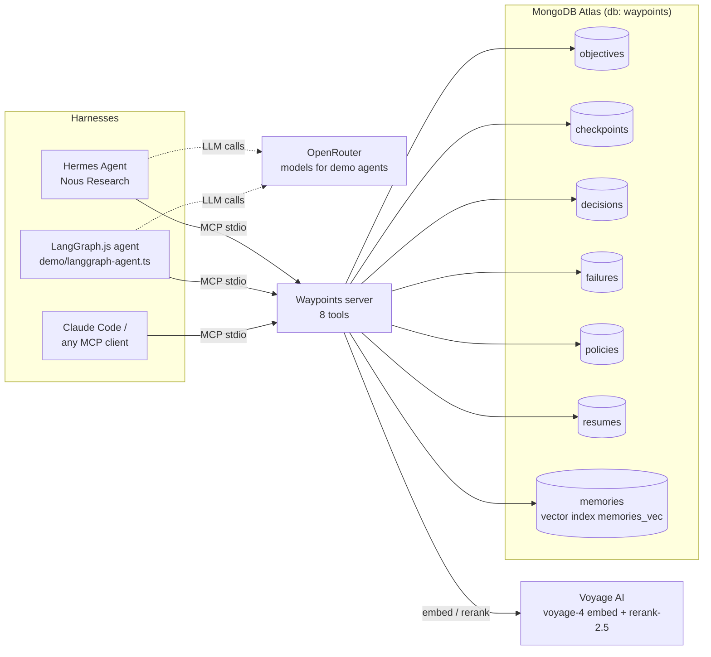

# Waypoints

An MCP server that gives any agent harness crash-proof long-horizon memory and self-adopted policy, on MongoDB Atlas.

Built during the Harness Engineering & Model Wrangling Hackathon on 2026-09-26.

## The problem

- An agent's working state lives in its context window. A crash, `kill -9` or context reset wipes it, and the next session starts from zero.
- That state belongs to one harness. A different agent can't pick up where the first one stopped.
- Agents repeat the same class of mistake because nothing turns a failure into a standing rule.

Tracks:

- **Long Horizon Engineering**: objectives, measurable bearings, ordered waypoints and checkpoints live in Atlas. Any session can call `resume` and get the state back.
- **Recursive Harnessing**: a failure class that recurs becomes a versioned policy through `adapt`. Every later session gets that policy from `resume`.

## How it works

Waypoints is one stdio MCP server (`src/server.ts`). The harness stays whatever it already is. It mounts Waypoints and calls its tools.



Every checkpoint, decision and failure is also written to `memories` as text plus a 1024-dim `voyage-4` embedding. `recall` runs `$vectorSearch` on `memories_vec`, filtered by `kind` and `objective_id`, then reranks the results with `rerank-2.5`. When Voyage is unavailable, memories are stored without a vector and `recall` returns the most recent matches.

## The 8 tools

Every tool that takes `agent` records which harness made the call (e.g. `"hermes"`, `"langgraph"`).

| Tool | What it does | Writes |
|---|---|---|
| `set_objective` | Starts an objective with a goal, numeric bearings (`name`, `target`, `unit`) and ordered waypoints (`title`, `done_when`). The first waypoint becomes active. | `objectives` |
| `checkpoint` | Saves a working-state snapshot (`state_summary`, `open_threads`, `next_action`) with a per-objective sequence number. Can also update bearings (`bearings_current`) and mark a waypoint done (`waypoint_done`), which advances the active waypoint. | `checkpoints`, `objectives`, `memories` |
| `resume` | Called first in a new session. Rebuilds the objective, bearings with delta to target, the current waypoint, the last checkpoint, open threads, next action, the last 3 decisions, the last 3 failures with postmortems, active policies, and `previous_agent`. Without `objective_id` it picks the most recently updated active objective. | `resumes` |
| `log_decision` | Appends a decision with its rationale and optional evidence. | `decisions`, `memories` |
| `log_failure` | Records a typed failure (class normalized to lowercase-kebab) and returns a deterministic postmortem: occurrence count, prior failures of the same class, `is_recurring`, and a suggested policy. | `failures`, `memories` |
| `recall` | Semantic search over past checkpoints, decisions and failures (`kind`, `objective_id`, `limit` ≤ 20). | none |
| `adapt` | Promotes a failure's suggested policy to an active, versioned policy if the gate passes. Supersedes the previous active version for that class. | `policies` |
| `list_policies` | Lists policies by status (`active` by default, or `superseded` / `any`), optionally for one objective. | none |

## Data model

One database (`WAYPOINTS_DB`, default `waypoints`). `bun run setup` creates the collections, their indexes and the vector index.

- `objectives`: goal, `status` (`active`/`completed`), bearings, waypoints, `checkpoints_count`, `agent`, `last_agent`.
- `checkpoints`: state snapshot per `seq`, with a bearings snapshot, active waypoint and token estimate.
- `decisions`: append-only decision ledger.
- `failures`: typed failure plus its postmortem.
- `policies`: versioned rules adopted from failures, with provenance and the gate result.
- `resumes`: one event per `resume` call (`resumed_by`, `previous_agent`, `from_checkpoint_seq`).
- `memories`: embedded text of every checkpoint, decision and failure (`kind`, `source_id`), indexed by `memories_vec`.

Example `checkpoints` document:

```js
{
  _id: ObjectId("..."),
  objective_id: ObjectId("..."),
  seq: 3,
  state_summary: "Fixed billableDays off-by-one; 6/10 tests pass.",
  open_threads: ["paginate returns one item too many", "taxCents rounding"],
  next_action: "Fix the paginate end index",
  bearings_snapshot: [{ name: "tests_passing", current: 6, target: 10, unit: "tests" }],
  active_waypoint_index: 1,
  waypoint_completed_index: null,
  token_estimate: 31,
  agent: "hermes",
  created_at: ISODate("2026-09-26T...")
}
```

Example `policies` document:

```js
{
  _id: ObjectId("..."),
  objective_id: ObjectId("..."),
  rule: "Before fix the paginate end index, check for off-by-one.",
  class: "off-by-one",
  from_failure_id: ObjectId("..."),
  version: 1,
  status: "active",            // becomes "superseded" (with superseded_at) when a newer version is adopted
  reversible: true,
  gate: {
    passed: true,
    rule: "class must have at least 2 occurrences on this objective, or explicit_approval must be true",
    occurrences_of_class: 2,
    explicit_approval: false
  },
  agent: "langgraph",
  created_at: ISODate("2026-09-26T...")
}
```

The `rule` is built from a template, `Before <next_action>, check for <class>.`, using the last checkpoint's `next_action`.

## Why the policy gate is deterministic

- **Model proposes, code approves.** The agent decides when to call `adapt`. Whether a policy is adopted is decided in code (`ADAPT_MIN_OCCURRENCES = 2` in `src/waypoints.ts`): the failure class needs at least 2 occurrences on the objective, or the caller passes `explicit_approval: true`. No LLM is in the loop. The postmortem is also computed from database counts, not generated.
- **Auditable.** Every policy stores the gate result, the source `from_failure_id` and the adopting agent. `resume` returns `from_failure_agent`, so you can see that Hermes's failure became a rule that LangGraph followed.
- **Reversible.** Policies are versioned per class. Adopting a new version marks the old one `superseded` instead of deleting it.

## Demo

A small TypeScript fixture (`demo/fixture/invoice.ts`) has 5 planted bugs (2 `off_by_one`, 2 `unit_conversion`, 1 `rounding`). The goal is 10/10 tests passing. Both harnesses follow the same spec, `demo/task.md`. The bearing is `tests_passing`.

```sh
bun run demo:clean       # wipe demo objectives from the Waypoints DB, restore the buggy fixture
bun run demo:hermes      # Hermes Agent works the task via Waypoints; prints its pid
kill -9 <pid>            # from a second terminal, after a checkpoint or two: simulated crash
bun run demo:langgraph   # LangGraph.js agent calls resume (previous_agent: hermes) and finishes
```

What to look for:

1. Hermes calls `set_objective`, then after every `bun test` it calls `checkpoint` with the pass count. It logs one typed failure per failing test. When a class recurs, `adapt` turns it into a policy.
2. After `kill -9` there is no graceful shutdown and no handoff.
3. The LangGraph agent's `resume` returns the objective, current waypoint, open threads, `next_action`, recent failures, active policies and `previous_agent: "hermes"`. It continues from that state and the bearing climbs to 10.

LangGraph agent options: `--fresh` (new objective), `--max-steps N`, `--die-after N` (the agent SIGKILLs itself, a fallback demo that doesn't need Hermes), `DEMO_MODEL=<slug>`, `WAYPOINTS_DEBUG=1`. See `demo/README.md`.

Still being built during the event (the command names are listed, but check `package.json` for what has landed): `bun run watch` (live view of Waypoints writes), `bun run demo:layout`.

## Run it yourself

Prerequisites:

- bun ≥ 1.4 (bson crashes on import under bun 1.3.x)
- A MongoDB Atlas cluster (we used the Atlas Hackathon Sandbox)
- A Voyage AI API key
- An OpenRouter API key (only needed by the demo agents)
- For `demo:hermes`: Hermes Agent installed at `~/.local/bin/hermes`, or set `HERMES_BIN`

Setup:

```sh
bun install
cp .env.example .env   # then fill in MONGODB_URI, VOYAGE_API_KEY, OPENROUTER_API_KEY
bun run check          # smoke-tests MongoDB, OpenRouter and Voyage credentials
bun run setup          # creates collections, indexes and the memories_vec vector index (idempotent)
bun run smoke          # exercises the tools against Atlas
bun run server         # starts the MCP server on stdio
```

Bun loads `.env` from the current working directory. Start the server from the repo root, or pass the variables to it yourself.

From Claude Code:

```sh
claude mcp add waypoints -- bun --cwd /abs/path/to/mongo-hack run src/server.ts
```

From any MCP client (stdio):

```json
{
  "mcpServers": {
    "waypoints": {
      "command": "bun",
      "args": ["run", "src/server.ts"],
      "cwd": "/abs/path/to/mongo-hack"
    }
  }
}
```

If your client has no `cwd` option, pass `MONGODB_URI`, `VOYAGE_API_KEY` and, optionally, `WAYPOINTS_DB` through its `env` block instead.

## Built with

- **MongoDB Atlas**: document store for all state, and Atlas Vector Search (`$vectorSearch` on `memories_vec`)
- **Voyage AI**: `voyage-4` embeddings and `rerank-2.5`
- **OpenRouter**: models for the demo agents
- **LangGraph.js** with `@langchain/mcp-adapters`: our resuming demo agent
- **Hermes Agent** (Nous Research): third-party harness used as-is in the demo. We wrote only its config and launch script (`demo/hermes/`).
- **MCP TypeScript SDK** (`@modelcontextprotocol/sdk`), zod, bun

## Built at the hackathon

All code in this repo was written on 2026-09-26 during the event. The first commit is at 10:37 ET, and the git history is the record. We did not write these third-party components: Hermes Agent, the SDKs and libraries listed in `package.json`, and the official documentation snapshots in `docs/refs/`.

## Submission checklist (internal)

- [ ] Uses Atlas Hackathon Sandbox
- [ ] Repo is public
- [ ] 1-min demo video recorded, and the link works in a private window
- [ ] Submitted on Cerebral Valley by 5:00PM
- [ ] All team members added
- [ ] Demo shows only event work
- [ ] Delete `team/` and the "Team" section of CLAUDE.md
- [ ] Teammate confirmed for MongoDB.local 9/30
