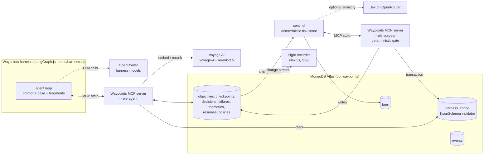

# The Waypoints harness

A self-modifying agent harness whose memory, settings and guardrails live in MongoDB Atlas. It can change its route, never its destination.

Built during the Harness Engineering & Model Wrangling Hackathon on 2026-09-26.

## The problem

- An agent's working state lives in its context window. A crash, `kill -9` or context reset wipes it, and the next session starts from zero.
- A harness that "improves itself" usually means a model rewriting its own prompt. Nothing stops it drifting away from the goal, and nothing undoes a bad change.
- Long runs fail quietly: a fix that breaks something that used to work looks like progress until someone reads the test output.

## Tracks

- **Long Horizon Engineering.** The objective, an immutable end state, numeric bearings, waypoints and checkpoints live in Atlas. After a crash, `resume` rebuilds a bounded working state. A hard metric (the tracked bearing) drives everything: when it drops, the server itself logs a `regression` failure.
- **Recursive Harnessing.** The harness's own settings (prompt fragments, required tools, sentinel threshold, model) are versioned documents in `harness_config`. A sentinel scores risk on every failure and checkpoint. When it taps, a separate surgeon role changes one setting through a deterministic gate, on probation, and the change is kept or rolled back automatically from the bearing.

## How it works



1. The harness calls `resume`, then `get_settings`. Its system prompt is a fixed base prompt plus the text of the enabled fragments.
2. After every test run it calls `checkpoint` with the pass count and the `settings_version` it is running. If the model skips that checkpoint, the harness writes it (`required_tools: ["checkpoint"]`).
3. If the tracked bearing dropped since the previous checkpoint, the server inserts a `regression` failure, a memory and an `auto_failure` event.
4. The sentinel sees the failure on a change stream, computes the risk score and, above the current threshold, decides an action. For a regression with `verify_whole_suite` off, it calls the surgeon's `apply_settings_change`, which creates a new `harness_config` version on probation.
5. The next `checkpoint` or `resume` response carries `settings.reload: true` and the open tap. The harness calls `get_settings` again and rebuilds its prompt.
6. On each later checkpoint the sentinel calls `evaluate_probation`. After 2 checkpoints the version is kept if the bearing is at or above its baseline and the watched class didn't recur. Otherwise it is rolled back in a transaction.
7. The flight recorder streams all of this from Atlas change streams.

Every checkpoint, decision and failure is also stored in `memories` with a 1024-dim `voyage-4` embedding. `recall` runs `$vectorSearch` on `memories_vec` and reranks with `rerank-2.5`. If Voyage is unavailable (4s timeout, no retries, 60s pause after a 429), memories are stored without a vector and `recall` returns the most recent matches.

## Key ideas

- **Immutable end state.** `set_objective` writes `end_state: { description, bearing, target }` once. No tool updates it. `harness_config` can't express it either: the `$jsonSchema` validator sets `additionalProperties: false` at every level, and the gate only accepts the four settings fields. The harness can change its route, never its destination.
- **Settings are versioned documents.** Each `harness_config` version changes exactly one field (`change: { field, from, to }`) and records its parent and reason. Inserting a version and superseding the previous one happen in one transaction. The current config is the highest version with status `active`, `probation` or `kept`.
- **Probation, then kept or rolled back automatically.** A new version starts on probation with the last checkpoint's bearing as its baseline. `evaluate_probation` decides after 2 checkpoints. A rollback marks the version `rolled_back` and re-inserts the parent's settings as a new `active` version, so history is never rewritten.
- **A fixed prompt-fragment library.** `src/fragments.ts` holds five fragments (`checkpoint_every_test`, `recall_before_edit`, `verify_whole_suite`, `one_change_per_edit`, `read_policies_first`). Settings select fragment ids. The model never writes its own prompt text.
- **Role separation.** The harness mounts the agent role, which can read settings but has no tool that writes them. Settings and policy writes (`adapt`, `apply_settings_change`, `rollback_settings`, `evaluate_probation`) exist only on the surgeon role, which only the sentinel mounts. `docs/atlas-roles.md` describes an optional Atlas custom role that makes `harness_config` and `policies` read-only for the agent's DB user as a second wall. `bun run setup` does not create it.
- **A deterministic risk score.** `risk = 0.4·similarity + 0.3·recurrence + 0.3·trend`, each component in 0..1:
  - similarity: the best `$vectorSearch` score of the new failure against earlier failures on the objective (term-frequency cosine if the failure has no embedding)
  - recurrence: `min(1, (count of class − 1) / 2)`
  - trend: regression = 1, stall (bearing flat for 3 checkpoints) = 0.6, otherwise 0
  The action is chosen in code. Jev (`typesafe/jev-router`) can be asked for advice with `SENTINEL_ADVISOR=jev`. Its answer is stored on the tap and never decides anything.
- **Failures from the hard metric.** The agent can log failures itself, but it doesn't have to notice a regression: a drop in the tracked bearing makes the server log one.
- **Policies from recurring failures.** When a class recurs and the tap isn't a settings change, the sentinel calls `adapt`. Its gate is also deterministic: at least 2 occurrences of the class, or `explicit_approval`.

## Tools per role

`bun run src/server.ts --role agent|surgeon` (default `agent`).

Agent role (what the harness, or any MCP client, mounts):

| Tool | What it does |
|---|---|
| `set_objective` | Goal, numeric bearings, ordered waypoints and the immutable `end_state` (default: the first bearing's target). |
| `checkpoint` | Saves a state snapshot and bearing values. Returns `settings { current_version, reload }`, the latest open tap and `end_state`. Logs an automatic `regression` failure if the tracked bearing dropped. |
| `resume` | Call first. Returns the objective, end state, bearings, current waypoint, last checkpoint, open threads, next action, last 3 decisions, last 3 failures with postmortems, active policies, `previous_agent`, settings status and any open tap. |
| `log_decision` | Appends to the decision ledger. |
| `log_failure` | Records a typed failure and returns a deterministic postmortem (occurrence count, prior failures, suggested policy). |
| `recall` | Semantic search over checkpoints, decisions and failures. Writes a `recall` event. |
| `get_settings` | Current version, status, settings and the enabled fragments' `{ id, title, text }`. |
| `list_policies` | Active (or superseded / all) policies. |

Surgeon role (mounted only by the sentinel):

| Tool | What it does |
|---|---|
| `adapt` | Promotes a failure's suggested policy to a versioned policy if the gate passes. |
| `apply_settings_change` | Changes one setting through the gate. Refused while another version is on probation, or if the value is unchanged or not in the enums. |
| `rollback_settings` | Rolls back the current version and re-activates its parent's settings as a new version. |
| `evaluate_probation` | Keeps or rolls back the version on probation. |

## Collections

One database (`WAYPOINTS_DB`, default `waypoints`). `bun run setup` creates collections, indexes, the `memories_vec` vector index and the `harness_config` validator, and seeds settings v1.

- `objectives`: goal, immutable `end_state`, bearings, waypoints, status, `last_agent`.
- `checkpoints`: state snapshot per `seq`, with a bearings snapshot.
- `decisions`: append-only decision ledger.
- `failures`: typed failures with postmortems (`auto: true` when the server logged a regression).
- `memories`: embedded text of every checkpoint, decision and failure.
- `resumes`: one document per `resume` call (who resumed, from which checkpoint, previous agent).
- `policies`: versioned rules adopted from recurring failures, with the gate result.
- `harness_config`: one document per settings version, validated by `$jsonSchema`.
- `taps`: every sentinel score (risk, components, weights, trigger, advisor, deterministic decision). Below-threshold scores are recorded but never delivered.
- `events`: plain-English narration for the flight recorder (`recall`, `settings_reload`, `tap_acknowledged`, `probation_verdict`, `auto_failure`).

Example `harness_config` document after a regression tap (shape from `src/settings.ts`, values illustrative):

```js
{
  _id: ObjectId("..."),
  version: 2,
  status: "probation",                  // later "kept", or "rolled_back" plus a new "active" v3
  settings: {
    prompt_fragments: ["checkpoint_every_test", "read_policies_first", "verify_whole_suite"],
    required_tools: ["checkpoint"],
    sentinel_threshold: 0.25,
    model: "anthropic/claude-sonnet-5"
  },
  parent_version: 1,
  change: { field: "prompt_fragments",
            from: ["checkpoint_every_test", "read_policies_first"],
            to: ["checkpoint_every_test", "read_policies_first", "verify_whole_suite"] },
  reason: { kind: "tap", id: ObjectId("..."), summary: "Regression (risk ...): verify the whole suite after each fix" },
  probation: { checkpoints_required: 2, baseline_bearing: 8, watch_class: "regression", started_seq: 5 },
  outcome: null,                        // { decided_at, verdict: "kept" | "rolled_back", why }
  created_by: "surgeon",
  created_at: ISODate("2026-09-26T...")
}
```

## Long horizon, honestly

We can't show billions of tokens in a one-day hackathon, and we don't claim to. What the design does instead:

- **The agent's working context stays bounded.** `resume` returns the latest checkpoint, the last 3 decisions, the last 3 failures and the active policies (at most one per failure class), whatever the length of the history. A session restarted after checkpoint 5 or checkpoint 5,000 starts from a payload of the same shape.
- **Atlas holds the unbounded history.** Every checkpoint, decision, failure, resume, tap and settings version is kept as a document.
- **Recall retrieves on demand.** Older context comes back through `recall` (vector search plus rerank) only when the agent or a tap asks for it.
- **Bearings and the sentinel keep the run pointed at the end state.** The tracked bearing is checked at every checkpoint, a drop becomes a failure automatically, and the sentinel reacts to regressions and stalls without the agent having to notice them.

The demo shows the mechanism on a short task: a hard kill, a resume from Atlas, and a settings change judged by the metric.

## Demo

The fixture (`demo/fixture/`) is a small invoice module with 10 tests, a few planted bugs and one trap: the obvious fix to a helper breaks a test that was passing. The end state is `tests_passing` = 10. See `demo/README.md` for the current flags.

```sh
bun run demo:clean                 # wipe Waypoints documents, reset harness_config to seed v1, restore the fixture
bun run setup                      # collections, indexes, validator, seed (idempotent)
bun run sentinel                   # second pane: change streams, risk scores, taps
cd flight-recorder && bun run dev  # third pane: http://localhost:3100 (or `bun run watch` in the terminal)
bun run harness --fresh            # new objective; kill -9 it mid-task (or use --die-after N)
bun run harness                    # resumes from the last checkpoint and finishes
```

What to look for: `◎ END STATE` at start, the resume after `kill -9`, `▼ BEARING DROP` when the trap fix lands, `▲ TAP risk … → adjust_settings`, `⟳ SETTINGS v1 → v2 (probation): +verify_whole_suite`, the probation verdict in the sentinel pane and flight recorder, and `✔ all green`.

## Run it yourself

Prerequisites: bun ≥ 1.4 (bson crashes on import under bun 1.3.x), a MongoDB Atlas cluster (we used the Atlas Hackathon Sandbox), a Voyage AI key and an OpenRouter key.

```sh
bun install
cp .env.example .env   # fill in MONGODB_URI, VOYAGE_API_KEY, OPENROUTER_API_KEY
bun run check          # smoke-tests MongoDB, OpenRouter and Voyage credentials
bun run setup          # collections, indexes, memories_vec, harness_config validator + seed v1
bun run smoke          # exercises the tools against Atlas
```

Flight recorder: `cd flight-recorder && bun install && ln -sf ../.env .env.local && bun run dev`.

### Using Waypoints from Claude Code or any MCP client

Mount the agent role. Your client gets the same memory, end state and settings the harness uses, without any settings-writing tools.

```sh
claude mcp add waypoints -- bun --cwd /abs/path/to/mongo-hack run src/server.ts --role agent
```

```json
{
  "mcpServers": {
    "waypoints": {
      "command": "bun",
      "args": ["run", "src/server.ts", "--role", "agent"],
      "cwd": "/abs/path/to/mongo-hack"
    }
  }
}
```

Bun loads `.env` from the working directory. If your client has no `cwd` option, pass `MONGODB_URI`, `VOYAGE_API_KEY` and, optionally, `WAYPOINTS_DB` through its `env` block.

## Built with

- **MongoDB Atlas**: all state, `$jsonSchema` validation, multi-document transactions, change streams (sentinel and flight recorder) and Atlas Vector Search
- **Voyage AI**: `voyage-4` embeddings and `rerank-2.5`
- **OpenRouter**: harness models (Claude Sonnet 5 by default, with a fallback) and the optional Jev advisor
- **LangGraph.js** with `@langchain/mcp-adapters` and `@langchain/openai`: the harness loop
- **MCP TypeScript SDK** (`@modelcontextprotocol/sdk`): the server and the sentinel's surgeon client
- **Next.js**: the flight recorder
- zod, bun, TypeScript

Third-party components we did not write: LangGraph.js and the other SDKs and libraries in `package.json` and `flight-recorder/package.json`, and the official documentation snapshots in `docs/refs/`. Hermes Agent (Nous Research) was used in an earlier version of the demo. Its config and launch script remain in `demo/hermes/`, but it is not part of the product or the demo.

## Built at the hackathon

All code in this repo was written on 2026-09-26 during the event. The first commit is at 10:37 ET, and the git history is the record.

## Submission checklist (internal)

- [ ] Uses Atlas Hackathon Sandbox
- [ ] Repo is public
- [ ] 1-min demo video recorded, and the link works in a private window
- [ ] Submitted on Cerebral Valley by 5:00PM
- [ ] All team members added
- [ ] Demo shows only event work
- [ ] Delete `team/` and the "Team" section of CLAUDE.md
- [ ] Teammate confirmed for MongoDB.local 9/30
