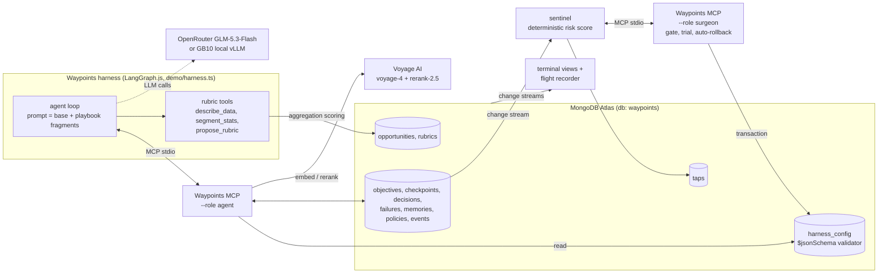

# Waypoints

A self-improving agent harness for long-running work. Its memory, playbook and guardrails live in MongoDB Atlas. It can change its route, never its destination.

Built during the Harness Engineering & Model Wrangling Hackathon on 2026-09-26.

## The use case: B2B deal qualification

Sales teams qualify deals with checklists like BANT or MEDDIC, and nobody knows whether the checklist actually predicts wins. The Waypoints harness runs unattended and keeps improving a points-based **deal-scoring rubric**. A deterministic Atlas aggregation grades every proposal against **real Won/Lost outcomes on held-out deals** the agent never sees.

- **Data:** 448 real B2B opportunities (227 Won / 221 Lost), 22 qualitative deal features. Hugging Face `markobo/B2B_Sales_data`, CC-BY-4.0, originally from Bohanec, Kljajić Borštnar & Robnik-Šikonja, "Explaining machine learning models in sales predictions", *Expert Systems with Applications* (2017). Used unmodified; see `data/README.md`.
- **Split:** fixed, seeded, stratified 70/30 train/holdout. Holdout rows never leave `src/sales/tools.ts`; the agent sees only train stats and holdout metrics.
- **End state (locked):** holdout AUC ≥ **0.89** (`T_AUC` in `src/sales/targets.ts`). That sits above the best simple rubric fit on train alone (0.881), so reaching it takes sustained iteration, and that's where overfitting and regressions actually happen.

## The problem

- **Crashes lose everything.** An agent's working state lives in its context window. A `kill -9` or context reset wipes it.
- **Agents repeat mistakes.** Here the classic one is overfitting: a rule on a segment with seven deals looks like progress on the training data and falls apart on the holdout.
- **Self-modifying agents move the goalposts.** "Self-improving" usually means a model rewriting its own prompt. Nothing stops it drifting off the goal, and nothing undoes a bad change.

## Tracks

- **Long Horizon Engineering.** The objective, the immutable end state, bearings, waypoints and every save point live in Atlas. After a crash, `resume` rebuilds a bounded working state and the run picks up from the best rubric so far.
- **Recursive Harnessing.** The harness's own playbook (prompt fragments, required tools, sentinel threshold, model) is a versioned document in `harness_config`. A sentinel scores risk on every failure; a separate surgeon role changes one setting through a deterministic gate, on a trial, and keeps or rolls it back from the metric.

## How it works



- **Harness** (ours, LangGraph.js): owns the protocol in code, not in the model's goodwill.
- **Waypoints MCP, agent role:** memory tools (`set_objective`, `checkpoint`, `resume`, `log_decision`, `log_failure`, `recall`, `get_settings`, `list_policies`). No tool writes settings.
- **Rubric tools** (`src/sales/tools.ts`): the model calls `describe_data`, `segment_stats` and `propose_rubric`. Scoring is an Atlas aggregation that sums rule points per deal with `$sum`/`$cond`; AUC (Mann-Whitney), A-grade win rate and coverage are computed from its output.
- **Sentinel** (`bun run sentinel`): watches failures and checkpoints on a change stream and scores risk with fixed weights.
- **Surgeon role:** `apply_settings_change`, `rollback_settings`, `evaluate_probation`, `adapt`. Mounted only by the sentinel.
- **Recall:** Voyage `voyage-4` embeddings, Atlas `$vectorSearch`, Voyage `rerank-2.5`.
- **Model:** `z-ai/glm-5.3-flash` on OpenRouter. `DEMO_PROVIDER=gb10` uses a local vLLM (GB10) serving GLM, with OpenRouter as fallback.

## The loop in plain English

| We say | In the code |
|---|---|
| score | bearing (`holdout_auc`, `a_grade_win_rate`) |
| save point | checkpoint |
| playbook | `harness_config` (one version per change) |
| alert | tap |
| trial | probation |

1. On start the harness calls `resume`, then `get_settings`. Its system prompt is the sales base prompt plus the text of the playbook's enabled fragments.
2. The model explores train-only stats and proposes a rubric. The Atlas scorer grades it on train and holdout.
3. The harness saves a checkpoint after every proposal, stamping the scores from the **holdout** metrics, never the model's claim. If the model moves on without one, the harness writes it and logs `skipped_checkpoint`.
4. The harness logs `overfit_segment` (gap > 0.08, or any rule on a value with < 15 train deals) and `invalid_rubric` itself. If holdout AUC drops by ≥ 0.005, the server logs a `regression` on its own.
5. The sentinel scores each failure: `risk = 0.4·similarity + 0.3·recurrence + 0.3·trend`. Similarity is the best `$vectorSearch` match against earlier failures; recurrence is `min(1, (count − 1) / 2)`; trend is 1 for a regression, 0.6 for a stall. Harness-detected protocol failures score full trend.
6. Above the playbook's threshold (seed 0.25) it raises an alert and the surgeon enables one fragment as a new playbook version on trial.
7. The next checkpoint tells the harness to reload; it rebuilds its prompt mid-run.
8. After 2 checkpoints the sentinel judges the trial: kept if the score held at or above its baseline and the failure didn't recur, otherwise rolled back automatically. The verdict records before/after counts, e.g. `v1: 3 overfit-segment in 6 checkpoints → v2: 0 in 2`.
9. A fresh run starts from the best rubric learned in earlier runs. History carries over.

## Failure classes and playbook fixes

From `SALES_FIX_FOR` in `src/sentinel.ts`:

| Failure class | Logged by | Fragment the surgeon enables (on trial) |
|---|---|---|
| `overfit-segment` | harness | `min_support_15`: only add a rule for a value with at least 15 train deals |
| `regression` | server | `one_change_per_iteration`: change exactly one rule per proposal |
| `skipped-checkpoint` | harness | `checkpoint_every_eval`: checkpoint right after every `propose_rubric` |
| `invalid-rubric` | harness | `check_schema_first`: call `describe_data` first; use only listed fields and values |

If the class recurs and no settings change applies, the sentinel calls `adapt` to promote a policy (gate: at least 2 occurrences).

## Safety

- **Immutable end state.** Written once by `set_objective`. No tool updates it.
- **Fixed fragment library.** `src/fragments.ts` holds the only prompt text. The playbook selects fragment ids; the model never writes its own prompt.
- **`$jsonSchema` validator on `harness_config`.** `settings` allows exactly four fields (`prompt_fragments`, `required_tools`, `sentinel_threshold`, `model`), fragment ids and models are enums, and there is nowhere to put a goal.
- **One change at a time.** Each version changes one field. While a version is on trial, further fixes are queued.
- **Trial with automatic rollback.** A rollback marks the version `rolled_back` and re-inserts the parent's settings as a new `active` version, in a multi-document transaction. Nothing is deleted.
- **Role separation.** The harness mounts the agent role, which can read settings but not write them. Only the sentinel mounts the surgeon role. `docs/atlas-roles.md` describes an optional Atlas custom role as a second wall (not created by `bun run setup`).
- **Deterministic decisions.** Weights and actions are chosen in code and stored on every tap. The optional Jev advisor (`SENTINEL_ADVISOR=jev`) is recorded, never decides.

## MongoDB Atlas features used

- **Documents** for all state: objectives, checkpoints, decisions, failures, memories, resumes, policies, taps, events, playbook versions, deals and rubrics.
- **Aggregation pipeline** as the rubric scorer, plus the train-only stats behind `describe_data` and `segment_stats`.
- **Atlas Vector Search** (`$vectorSearch`) over Voyage `voyage-4` embeddings, reranked with `rerank-2.5`, for `recall` and the sentinel's similarity score.
- **`$jsonSchema` validation** on `harness_config`.
- **Multi-document transactions** for playbook version switches and rollbacks.
- **Change streams** driving the sentinel, the flight recorder and the terminal views.

## Views

**Terminal glass box:** `bun run demo:layout` (herdr; `bun run demo:layout:tmux` for tmux). Four panes:
- harness, with the launch command pre-typed
- `view:prompt`: the exact system prompt the harness is running, with a diff when the playbook changes
- `view:rubric`: the latest rubric and holdout metrics, with a diff per version
- `view:atlas`: the raw Atlas change stream across collections

The sentinel runs in a second tab.

**Flight recorder** (`flight-recorder/`, Next.js on http://localhost:3100): a plain-English story view of the latest objective (end state, scores, alerts, playbook changes and verdicts), live from a change stream. `?replay=1&speed=20` replays real Atlas history with a scrubber.

## Run it yourself

Prerequisites: bun ≥ 1.4, a MongoDB Atlas cluster, a Voyage AI key and an OpenRouter key.

```sh
bun install
cp .env.example .env     # MONGODB_URI, VOYAGE_API_KEY, OPENROUTER_API_KEY
bun run check            # smoke-tests the credentials
bun run setup            # collections, indexes, vector index, validator, seed playbook v1
bun run load:sales       # load the deals into waypoints.opportunities (idempotent)
bun run sentinel         # second pane
cd flight-recorder && bun install && ln -sf ../.env .env.local && bun run dev   # optional
```

Then:

```sh
bun run harness --fresh --die-after-checkpoint 3   # new objective; kills itself mid-task after checkpoint 3
bun run harness                                    # resumes from Atlas and iterates toward the end state
```

- Flags: `--fresh` (new objective), `--die-after-checkpoint N`, `--die-after N` (tool calls), `--max-steps N` (default 15 proposals), `--task sales|invoice`.
- `DEMO_PROVIDER` empty uses OpenRouter GLM; `DEMO_PROVIDER=gb10` uses `GB10_BASE_URL`, `GB10_MODEL`, `GB10_API_KEY`. `DEMO_MODEL=<slug>` overrides.
- `bun run demo:clean` archives the open objective and keeps history; `--hard` wipes everything and reseeds playbook v1.

Seed playbook v1: fragments `["read_policies_first"]`, required tools `["checkpoint"]`, threshold 0.25, model `z-ai/glm-5.3-flash`.

### Using Waypoints from Claude Code or any MCP client

Mount the agent role to get the same memory, end state and playbook the harness uses, without any settings-writing tools.

```sh
claude mcp add waypoints -- bun --cwd /abs/path/to/mongo-hack run src/server.ts --role agent
```

```json
{
  "mcpServers": {
    "waypoints": {
      "command": "bun",
      "args": ["run", "src/server.ts", "--role", "agent"],
      "cwd": "/abs/path/to/mongo-hack"
    }
  }
}
```

Bun loads `.env` from the working directory. Without a `cwd` option, pass `MONGODB_URI`, `VOYAGE_API_KEY` and optionally `WAYPOINTS_DB` through `env`.

## Long horizon, honestly

We didn't run billions of tokens in a one-day hackathon, and we don't claim to.

- **The working context stays bounded.** `resume` returns the latest checkpoint, the last 3 decisions, the last 3 failures and the active policies, whatever the history length. A restart after checkpoint 5 or 5,000 gets a payload of the same shape.
- **Atlas holds the unbounded history.** Every checkpoint, decision, failure, resume, alert, rubric and playbook version is kept.
- **Recall retrieves on demand** through vector search plus rerank.
- **Scores and the sentinel keep the run pointed at the end state** without the agent having to notice its own regressions.

## Built at the hackathon

All code in this repo was written on 2026-09-26 during the event. The first commit is at 10:37 ET; the git history is the record.

Third-party components we did not write: LangGraph.js, the MCP SDK and the other libraries in `package.json` and `flight-recorder/package.json`, the dataset (see attribution above), and the documentation snapshots in `docs/refs/`. Hermes Agent (Nous Research) was used in an early version of the demo; its config remains unused in `demo/hermes/`. The original invoice-fixing task remains as `--task invoice` (`bun run harness:invoice`).

## Submission checklist (internal)

- [ ] Uses Atlas Hackathon Sandbox
- [ ] Repo is public
- [ ] 1-min demo video recorded, and the link works in a private window
- [ ] Submitted on Cerebral Valley by 5:00PM
- [ ] Demo shows only event work
- [ ] Teammate confirmed for MongoDB.local 9/30
