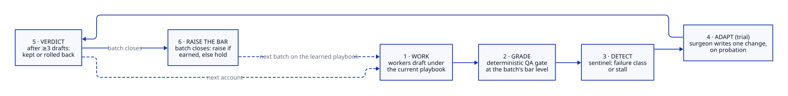
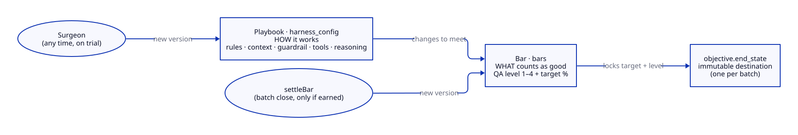
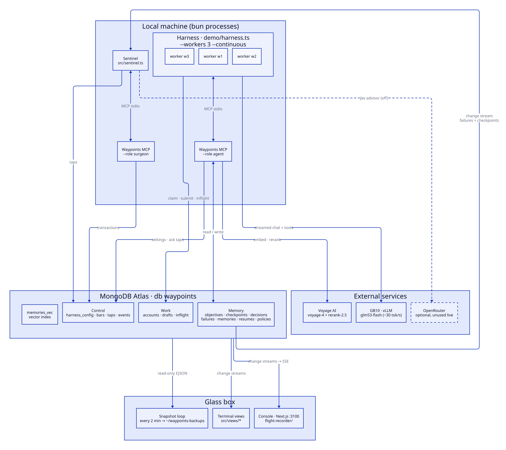
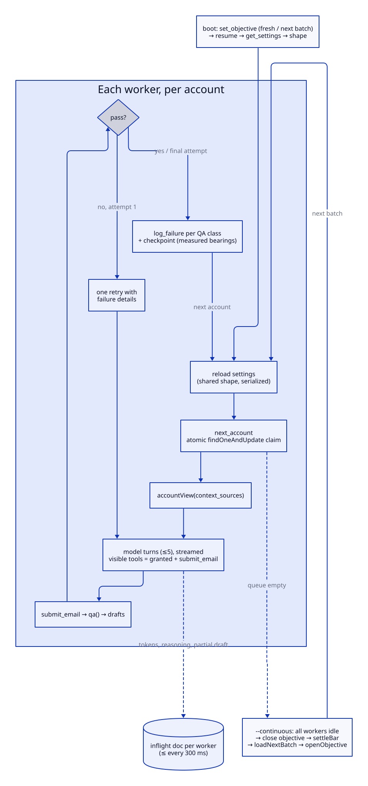
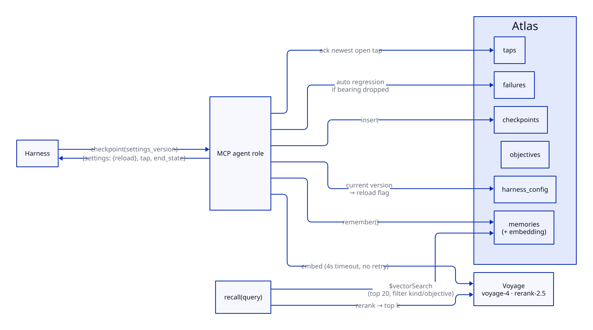
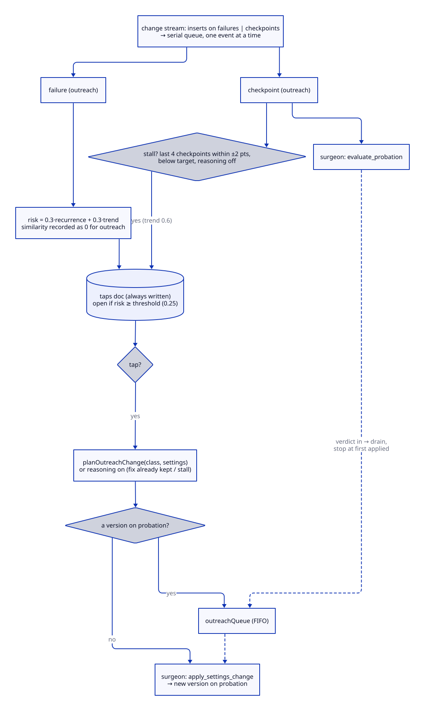
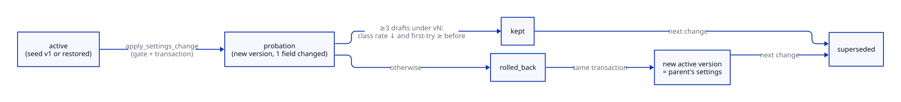
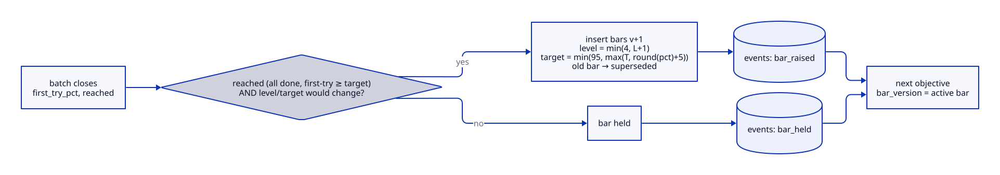
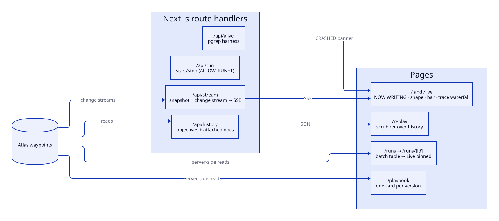

# Waypoints: architecture overview

As of 2026-09-26. Written from the code. Where a doc disagrees with the code, the code wins, and the mismatch is flagged with **⚠ Doc drift**.

Diagram sources are in `docs/architecture/*.d2`. To re-render them: `d2 --layout=elk --theme=0 --pad=40 x.d2 x.svg`.

---

## 1. Overview

Waypoints is a self-improving harness for long-running agent work. The live task is SDR outreach: GLM workers on a GB10 write first-touch emails for 85 real CRM accounts, in batches. A deterministic QA gate grades every draft. When drafts fail, a sentinel reads the failure class from Atlas and a separate surgeon role rewrites **one** thing about the harness. That change goes on trial, and the numbers decide whether it's kept or rolled back. The playbook, the bar, the memory and every verdict are documents in MongoDB Atlas.

**Change the route, never the destination.** The objective's `end_state` is written once. Nothing in the playbook can express a goal, and the `$jsonSchema` validator rejects any attempt to add one.

### The loop

| Stage | What happens | Where |
|---|---|---|
| 1 · WORK | Workers draft emails under the current playbook | `demo/packs/outreach.ts` |
| 2 · GRADE | Deterministic QA at the batch's bar level (1–4) | `src/outreach/qa.ts` |
| 3 · DETECT | Sentinel maps a failure class, or a stall, to a planned change | `src/sentinel.ts` |
| 4 · ADAPT (trial) | Surgeon writes one playbook version, on probation | `src/settings.ts` `applySettingsChange` |
| 5 · VERDICT | After ≥ 3 drafts under the new version: kept or rolled back, decided once | `src/settings.ts` `outreachVerdict` |
| 6 · RAISE THE BAR | At batch close the bar rises only if earned; otherwise it holds | `src/outreach/bar.ts` `settleBar` |

### Two ladders

- **Playbook (`harness_config`)** is *how it works*: rules, context policy, guardrail, tool access, reasoning. The surgeon changes it at any time, always on trial.
- **Bar (`bars`)** is *what counts as good*: the QA level (1–4) plus a target first-try %. It rises only when a batch earns it.
- The playbook changes in order to meet the bar. The bar moves only on evidence. Each batch's `end_state` locks the bar it started under.

---

## 2. System architecture

| Process | Command | Role |
|---|---|---|
| Harness | `bun run resume` → `demo/harness.ts --workers 3 --continuous` | N GLM workers. Claims accounts, drafts, submits. Mounts MCP `--role agent` |
| Waypoints MCP (agent) | `src/server.ts --role agent` (stdio child of the harness) | Memory tools. Reads settings. Cannot write settings |
| Sentinel | `src/sentinel.ts` (started by `resume`) | Change stream on failures + checkpoints. Scores risk, writes taps. Mounts MCP `--role surgeon` |
| Waypoints MCP (surgeon) | `src/server.ts --role surgeon` (stdio child of the sentinel) | The only writer of `harness_config` |
| Console | `cd flight-recorder && bun run dev` (:3100) | Next.js. SSE over Atlas change streams |
| Terminal views | `bun run view:drafts / view:prompt / view:atlas`, `bun run watch` | Read-only change-stream panes |
| Snapshot loop | `scripts/snapshot-loop.ts` (started by `resume`) | Every 2 min, runs `~/waypoints-backups/snapshot.ts`: a read-only EJSON dump |

**External services**

| Service | Used for | Notes |
|---|---|---|
| GB10 · vLLM `glm53-flash` | Every harness model call | About 30 tok/s. `DEMO_PROVIDER=gb10`. `reasoning` maps to `chat_template_kwargs.enable_thinking` |
| Voyage AI | `voyage-4` embeddings (1024-d), `rerank-2.5` | 4 s timeout, no retries. Pauses 60 s after a 429. Degrades to lexical or recency search |
| OpenRouter | Optional only | Jev advisor (`SENTINEL_ADVISOR=jev`, off) and the non-GB10 fallback path. Unused in the live run |

---

## 3. Core features

### a) The harness

**What it does:** runs the outbound queue with N concurrent workers. The harness, not the model, owns the protocol: claiming, grading, logging failures, checkpoints and reloads.

**How it works**
- **Entry:** `demo/harness.ts`. `--task outreach` is the default and goes to `runOutreach()` in `demo/packs/outreach.ts`. The sales and invoice packs use a LangGraph `StateGraph`. The outreach pack is a hand-written worker loop over LangChain `ChatOpenAI` plus `@langchain/mcp-adapters`.
  - **⚠ Doc drift:** the outreach path doesn't use a LangGraph graph. "LangGraph.js" is only accurate for the sales and invoice packs.
- **Task packs:** `demo/packs/types.ts` (`TaskPack`: sales and invoice), `outreach.ts` (standalone), `sales.ts`, `invoice.ts`.
- **Atomic claims:** `next_account()` in `src/outreach/tools.ts` runs one `findOneAndUpdate`. It takes the worker's own unfinished claim first. Otherwise it takes the lowest `queue_index` that is `pending`, or `in_progress` with a claim older than 12 min (`STALE_CLAIM_MS`). Two workers never get the same account.
- **Settings are applied on every account:** before each claim, `reload()` calls `get_settings` inside a single `serial()` mutex. The shared `Shape` rebuilds four things:
  - the system prompt: the base prompt plus fragment texts
  - `accountView(context_sources)`: what the model sees about the account
  - `visibleTools`: granted tools plus `submit_email`, and `precheck_email` when it's required
  - the model binding: `reasoning` sets `enable_thinking`, and sets `tool_choice` to `required` when reasoning is off or `auto` when it's on
- **Per attempt:** at most 5 model turns, streamed. A failed first attempt gets exactly one retry, with the failure details. `MAX_ATTEMPTS = 2`.
- **After each submit:** the harness calls `log_failure` once per QA class, then `checkpoint` with measured bearings from `getQueueStats`: `qa_pass_rate` (rolling over the last 10) and `accounts_done`. These are never the model's claims.
- **Streaming to `inflight`:** the `Inflight` class in `demo/packs/inflight.ts` upserts one doc per worker, at most every 300 ms. It carries the phase, the reasoning tail, and the partial subject and body parsed from streaming tool-call JSON (`partialField`). `glmToolMarkup` recovers tool calls that vLLM leaves in `content`.
- **`--continuous`:** when the queue is empty, `nextBatch()` waits at a barrier until every worker is idle. `switchBatch()` then runs these steps, and the playbook carries over to the new batch:
  1. final checkpoint
  2. objective → `completed`
  3. `settleBar`
  4. `loadNextBatch` (moves done accounts to `contacted` and promotes the next 24 `reserve` accounts; when reserve is empty it starts a new campaign)
  5. `openObjective`, stamped with `bar_version`

**Data**

| Collection | Reads | Writes |
|---|---|---|
| `accounts` | status, queue_index, claimed_by | status, claimed_by, claimed_at |
| `drafts` | — | account, subject, body, qa, qa_level, settings_version, attempt, worker, batch, campaign |
| `inflight` | — | worker, phase, text, reasoning, tokens, account, tool |
| `objectives` | bar_version, batch | batch, campaign, bar_version, level, target, status, final |

---

### b) Waypoints memory server (MCP)

**What it does:** provides durable, bounded working memory for any MCP client. It serves the harness here, and can also serve Claude Code (`claude mcp add waypoints …`).

**Roles** (`src/server.ts`; the tool is refused unless the role mounts it)

| Role | Tools | Mounted by |
|---|---|---|
| `agent` | `set_objective`, `checkpoint`, `resume`, `log_decision`, `log_failure`, `recall`, `get_settings`, `list_policies` | The harness |
| `surgeon` | `apply_settings_change`, `rollback_settings`, `evaluate_probation`, `adapt` | The sentinel only |

**How it works** (`src/waypoints.ts`)
- **`checkpoint`** does five things:
  1. inserts `{seq, state_summary, open_threads, next_action, bearings_snapshot}`
  2. if the tracked bearing dropped, auto-logs a `regression` failure and an `auto_failure` event
  3. embeds the checkpoint into `memories`
  4. returns `settings: {current_version, reload}`, the newest open tap (and acknowledges it, with a `tap_acknowledged` event), and `end_state`
- **`resume`** returns the latest checkpoint, the last 3 decisions, the last 3 failures, active policies, the settings version and any open tap. The payload is the same size whether there are 5 checkpoints or 5,000.
- **`log_failure`** normalizes the class to kebab case, attaches a deterministic postmortem (occurrences, prior failures of the same class, a suggested policy), and embeds it.
- **`recall`** (`src/memory.ts`): Voyage `voyage-4` query embedding → `$vectorSearch` on `memories_vec` (100 candidates, top 20, filterable by `kind` and `objective_id`) → Voyage `rerank-2.5` → top k. Without Voyage it falls back to the most recent memories.
- **`end_state`** is set once by `set_objective`. No tool updates it.

**Data:** writes `objectives`, `checkpoints`, `decisions`, `failures`, `memories` (with `embedding`), `resumes`, `policies`, `events`. Acknowledges `taps`. Reads `harness_config`.

---

### c) Deterministic QA gate

**What it does:** grades every draft with no LLM, at the batch's bar level. The harness can never change it.

**How it works:** `qa(draft, account, level)` in `src/outreach/qa.ts`. Levels are cumulative. `precheck_email` and `submit_email` resolve the level through `levelForObjective()`: objective → `bar_version` → level. If there's no `bar_version`, the level is 1.

| Level | Adds check | Fails when |
|---|---|---|
| 1 | `invented-fact` | A number that isn't a record value or price (±1%), a location that isn't the record's, another account's name, or a parent-company claim when there is none |
| 1 | `missing-personalization` | The first sentence (after any greeting) names no account, sector, location, parent or record number |
| 1 | `forbidden-promise` | Matches `/free\|guarantee\|no risk\|discount\|\d+% off\|best price/i` |
| 1 | `placeholder-left` | Matches `[…]`, `{…}`, `<…>`, or `lorem` |
| 1 | `too-long` | Body over 120 words |
| 1 | `missing-cta` | The last 2 sentences (sign-off ignored) have no `?` and no call/chat/meet/demo/time |
| 1 | `missing-subject` | Subject is empty or over 60 characters |
| 2 | `generic-opener` | The opener is a pleasantry ("hope you're well", "touching base"…) |
| 2 | `subject-not-personal` | Subject doesn't contain the account name |
| 3 | `no-sector-fit` | Body doesn't name both the sector and a product. `too-long` tightens to 90 words |
| 4 | `no-specific-number` | No exact employees, revenue or founding-year figure |
| 4 | `weak-cta` | The ask proposes no day or time ("Tuesday at 10am") |

Covered by `tests/outreach-qa.test.ts` (34 tests) and `tests/outreach-qa-levels.test.ts` (17 tests).

---

### d) Sentinel

**What it does:** watches Atlas, decides deterministically, and never lets the model touch the playbook.

**How it works** (`src/sentinel.ts`)
- **Stream:** a single `db.watch()` on inserts into `failures` and `checkpoints`. Events go through a promise queue, one at a time. The stream restarts after 2 s on error.
- **Risk score:** the weights are `similarity 0.4 · recurrence 0.3 · trend 0.3`.
  - Recurrence is `min(1, (count − 1) / 2)`.
  - Trend is 1 for QA and protocol classes and for regressions, 0.6 for a stall, and 0 otherwise.
  - Outreach: similarity isn't computed (it's recorded as 0), so risk = 0.3·recurrence + 0.3·trend. Any QA failure scores ≥ 0.3 and clears the seed threshold of 0.25.
  - Sales and invoice: similarity is the top `$vectorSearch` score against earlier failures, with a lexical cosine fallback.
  - **⚠ Doc drift:** `CONTRACT.md` describes vector similarity for all tasks. The outreach path skips it by design.
- **Taps:** every scored event writes a `taps` doc, including below-threshold ones for the risk meter. Its status is `open` when it tapped, `acknowledged` when it didn't.
- **Failure class → architectural change** (`planOutreachChange`). This is a fixed map, and a class is skipped once its fix is already in place:

| Class | Change | Axis |
|---|---|---|
| `missing-personalization` | + fragment `open_with_record_fact` | rules |
| `invented-fact` | + context `account_record_full` | context policy |
| `forbidden-promise`, `placeholder-left` | `precheck_email` granted **and** required (one version, via the `guardrail` macro) | guardrail |
| `too-long`, `missing-cta`, `missing-subject` | + tool `outline_email` (for `missing-cta`, then + `plain_cta`) | tool access |
| `generic-opener` / `subject-not-personal` / `weak-cta` | + `specific_opener` / `personal_subject` / `specific_time_cta` | rules |
| `no-sector-fit` | + context `account_summary`, then + `sector_fit` | context → rules |
| `no-specific-number` | + context `account_record_full`, then + `cite_one_number` | context → rules |
| A class recurs after its fix was **kept** | `reasoning` off → on | reasoning mode |
| Stall | `reasoning` off → on | reasoning mode |

- **Stall detection:** on each checkpoint, a stall is the last 4 `qa_pass_rate` values all within ±2 points, below the objective's target, with reasoning still off. It taps with trend 0.6 and plans reasoning on.
  - **⚠ Doc drift:** `OUTREACH-PACK.md` says only "flat for 4 checkpoints".
- **One trial at a time:** while a version is on probation, new plans wait in `outreachQueue` (FIFO, one entry per class). Every checkpoint calls `evaluate_probation`. After a verdict, the queue drains until one change applies.

**Data:** reads `failures`, `checkpoints`, `objectives`, `harness_config`, `memories`. Writes `taps`. Every playbook write goes through the surgeon MCP.

---

### e) Surgeon + playbook versioning

**What it does:** is the only path that can change the harness. It makes one gated change per version, runs it on trial, and records the verdict.

**`harness_config` settings: 7 fields, 5 axes the sentinel uses** (`src/fragments.ts`)

| Field | Enum / range | Seed v1 | Axis |
|---|---|---|---|
| `prompt_fragments` | 16 fixed ids (`FRAGMENTS`) | `[read_policies_first]` | rules |
| `context_sources` | `account_name`, `account_summary`, `account_record_full`, `product_catalog` | name + catalog | context policy |
| `granted_tools` | `outline_email`, `precheck_email`, `lookup_account` | `[]` | tool access |
| `required_tools` | agent tools + `precheck_email` | `[checkpoint]` | guardrail (with granted) |
| `reasoning` | `off`, `on` | `off` | reasoning mode |
| `sentinel_threshold` | 0–1 | 0.25 | (not changed by outreach) |
| `model` | `MODELS` enum | `gb10` | (not changed by outreach) |

**How it works** (`src/settings.ts`)
- **Gate:** `gateChange(field, value, current)` is pure. It checks field ∈ `SETTINGS_FIELDS`, ids ∈ enums, no duplicates, and that the value actually differs from the current one. The request is refused if any version is already on probation.
- **Validator:** `HARNESS_CONFIG_SCHEMA` is a `$jsonSchema` with `additionalProperties: false` at every level, so nothing can hold a goal, objective or bearing. `bun run setup` applies it with `validationLevel: strict`.
- **Transactions:**
  - `applySettingsChange` inserts vN+1 (`probation`) and marks older current versions `superseded` in one transaction.
  - `rollbackTo` marks vN `rolled_back` and inserts the parent's settings as a new `active` version in one transaction. Nothing is ever deleted.
  - A conditional `{status: "probation"}` update stops two evaluations from deciding the same version twice.
- **Probation (outreach):** no verdict until **≥ 3 drafts** have `settings_version = N` (`OUTREACH_PROBATION_DRAFTS`).
  - **⚠ Doc drift:** `OUTREACH-PACK.md` says "3 checkpoints". The code counts drafts, and the checkpoint count is ignored for outreach.
- **Verdict** (`outreachVerdict`, single-shot): **kept** if the watched class's rate per draft fell (or stayed at 0) and the first-try pass rate didn't drop. A stall version is kept only if the first-try rate rose. The result is stored in `outcome.why`, e.g. `invented-fact: 5 in 8 drafts → 0 in 3; first-try 38% → 67%. Kept.`
- **Policies:** `adapt` (surgeon) promotes a failure's suggested policy after ≥ 2 occurrences. It's used by the sales and invoice paths.
- **⚠ Doc drift:** the `apply_settings_change` tool description still lists 4 fields. The gate accepts all 7, plus the `guardrail` macro.

---

### f) Rising bar

**What it does:** raises what "good" means, but only when a batch has proven it can meet the current bar.

**How it works** (`src/outreach/bar.ts`)
- **Seed:** v1, level 1, target 80%. `ensureBars` seeds it only when `bars` is empty.
- **`settleBar` at batch close** raises the bar if `reached` (every account done **and** first-try ≥ the current target) **and** the level or target would actually change:
  - `level = min(4, L+1)`
  - `target = min(95, max(T, round(first_try%) + 5))`
  - It inserts bar v+1, supersedes the old one and writes a `bar_raised` event.
- **Otherwise** the bar holds and a `bar_held` event is written. This includes a bar already at level 4 and 95%.
- Each new objective stamps `bar_version`. The whole batch is graded at that level (`levelForObjective`, which is cached per objective).

**Data:** `bars` {version, level, target_pct, checks, new_checks, status, earned_by{objective_id, batch, first_try_pct}}. `events` gets `bar_raised` / `bar_held`.

---

### g) Console + terminal glass box

**Console** (`flight-recorder/`, Next.js 16, :3100)
- **`/` and `/live`** (`app/live/Live.tsx`) use one SSE connection to `/api/stream`: a snapshot, then every change across 14 watched collections.
  - **NOW WRITING** shows one streaming row per worker from `inflight`, plus a **sentinel** row (newest tap: risk, TAP → axis) and a **surgeon** row (the version on trial, the last verdict).
  - **Harness shape** panel: tools, context, reasoning, rules.
  - **The bar** panel.
  - **Trace waterfall**: per draft, context → draft → QA gate (one chip per check at that level) → failures logged → sentinel tap. Change, verdict, bar and batch dividers sit between drafts, and a raw-JSON drawer opens any Atlas doc.
- **`/runs`** is a server-rendered table of objectives: duration, progress, first-try start → end, versions tried, bar. **`/runs/[id]`** is `Live` pinned to that objective.
- **`/playbook`** shows one card per `harness_config` version: the change, axis, reason and verdict.
- **`/replay`** (`Recorder`) replays real history from `/api/history` with a scrubber and 1/5/20/60× speed.
  - **⚠ Gap:** `/api/history` doesn't load `drafts` or `bars`, so Replay tells the story without the draft-level trace.
- **`/api/alive`** runs `pgrep` on the harness for the CRASHED banner. **`/api/run`** can start or stop the harness only with `ALLOW_RUN=1`.

**Terminal glass box** (`src/views/*`, read-only change streams)
- `view:drafts`: the latest draft, its QA verdict and pass rates
- `view:prompt`: the exact system prompt, tools, context and reasoning, diffed
- `view:atlas`: the raw change stream
- `watch`: an objective summary
- Layouts: `bun run demo:layout` (herdr) or `demo:layout:tmux`

---

### h) Safety & operations

| Guard | Mechanism | File |
|---|---|---|
| Locked end state | `end_state` is written once. No tool updates it, and no settings field can express it | `src/waypoints.ts`, `src/settings.ts` |
| Fixed fragment library | The playbook only selects ids. The prompt text lives in code | `src/fragments.ts` |
| Role separation | The agent role has no settings writes. The surgeon is mounted only by the sentinel | `src/server.ts` |
| Validator + transactions | `$jsonSchema` strict, and multi-doc transactions for every version switch | `src/settings.ts`, `scripts/setup-indexes.ts` |
| Guardrail in code | With `precheck_email` required, `submit_email` is refused unless that exact subject and body hash was prechecked. A refusal logs `skipped-precheck` | `demo/packs/outreach.ts`, `src/outreach/tools.ts` |
| History protection | `demo:clean --hard` refuses the live `waypoints` DB unless `WAYPOINTS_ALLOW_WIPE=yes-wipe-live-history`. Default clean only archives objectives | `demo/clean.ts` |
| Test isolation | Tests preload a random `waypoints_test_*` DB | `tests/preload.ts` |
| Backups | `snapshot-loop` runs every 2 min, and `pause` takes a final snapshot. The output is EJSON (embeddings stripped) in `~/waypoints-backups/<timestamp>/` | `scripts/snapshot-loop.ts` |
| Pause / resume | `pause`: SIGTERM to harness, sentinel and snapshots, release `in_progress` claims, set `inflight` to idle, snapshot. `resume`: GB10 and Console preflight (`--check`), start the sentinel and snapshots in the background, harness in the foreground (`--workers 3 --continuous`, never `--fresh`) | `scripts/pause.ts`, `scripts/resume.ts` |
| Tests | **73 spec-first tests**: QA 34, QA levels + bar ratchet + sentinel map 17, settings gate + probation verdict 18, queue claims + retry rule 4. Run with `bun run test:all` | `tests/*.test.ts` |

---

## 4. Data model (Atlas db `waypoints`)

| Collection | Purpose | Key fields | Writes | Reads |
|---|---|---|---|---|
| `objectives` | One per batch; immutable destination | objective, end_state, bearings, waypoints, status, batch, campaign, bar_version, level, target, final | MCP agent (`set_objective`, `checkpoint`), harness (batch fields) | Everyone |
| `checkpoints` | Save points | objective_id, seq, bearings_snapshot, state_summary, next_action | MCP agent | Sentinel (stream), `resume`, Console |
| `failures` | Typed failures + postmortem | class, failure, context, postmortem, auto | MCP agent (harness-driven, plus auto regression) | Sentinel (stream), verdicts, Console |
| `decisions` | Decision ledger | decision, rationale, evidence | MCP agent | `resume` |
| `memories` | Embedded recall store | kind, source_id, text, embedding (1024-d), embedding_model | MCP agent (`remember`) | `recall`, sentinel similarity (sales) |
| `resumes` | Resume log | resumed_by, … | MCP agent | Console |
| `policies` | Standing rules (sales/invoice) | rule, class, version, status, from_failure_id | Surgeon (`adapt`) | `resume`, `list_policies` |
| `harness_config` | **Playbook** versions | version, status, settings{7}, parent_version, change{field,from,to,also?}, reason, probation, outcome | Surgeon only (transactions) | Harness, sentinel, Console, views |
| `bars` | **Bar** versions | version, level, target_pct, checks, new_checks, status, earned_by | Harness (`settleBar`), setup (seed) | Harness, QA level lookup, Console |
| `taps` | Every sentinel score | risk, components, weights, trigger, decision{tap,action}, axis, change_words, settings_version_after, status | Sentinel; acknowledged by MCP agent | Harness (via checkpoint), Console |
| `events` | Plain-English narration | kind (recall, settings_reload, tap_acknowledged, probation_verdict, auto_failure, bar_raised, bar_held), text, detail | MCP agent, surgeon, harness | Console, views |
| `accounts` | Work queue (85 Maven CRM accounts) | account, sector, revenue_musd, employees, office_location, subsidiary_of, queue_index, status (pending / in_progress / done / failed / contacted / reserve), claimed_by | `load:accounts`, harness | Harness, QA, Console |
| `drafts` | Work product | account, subject, body, qa{pass,failures}, qa_level, settings_version, attempt, worker, batch, campaign | Harness (`submit_email`) | Verdicts, stats, Console, `view:drafts` |
| `inflight` | Live token stream, one per worker | worker, phase, text, reasoning, tokens, account, tool | Harness (`Inflight`) | Console NOW WRITING |
| `opportunities`, `rubrics` | Sales pack (dormant) | deals; rubric versions | `load:sales`, sales pack | Sales pack, `view:rubric` |

Vector index: `memories_vec` on `memories.embedding` (cosine, 1024), with filters `kind` and `objective_id`.

---

## 5. Current state

These are the last known numbers (from 2026-09-26). The live run is paused, and these were not re-queried.

| Metric | Value |
|---|---|
| Drafts written | 188 |
| First-try pass rate per batch | 67% → 96% → 92% → 100% → 92% |
| Playbook | v9 |
| Bar | v2: level 2, target 95% |

The bar reached level 2 after the first earned batch. Its target is capped at 95%, so later batches at 92% held the bar instead of raising it.

### Known gaps / next steps

- **Reply-rate feedback loop.** QA pass is a proxy. The real destination is replies and meetings; nothing feeds an outcome signal back yet.
- **The guardrail path hasn't fired live.** The `forbidden-promise` / `placeholder-left` → `guardrail` macro (precheck granted and required) hasn't triggered in the live run. No test covers the macro or the submit refusal either.
- **Real CRM integration.** Accounts come from a static CSV. There's no CRM read/write and no send.
- **Atlas Stream Processing for the sentinel.** Today it's a single local `db.watch()` process. Moving it would make detection a managed, always-on pipeline.
- **Hosted Console.** It's local only (`:3100`), and `/api/alive` and `/api/run` depend on local `pgrep`.
- Smaller items found while reading the code:
  - Replay doesn't load `drafts` or `bars`.
  - `skipped-precheck` and outreach `regression` failures score trend 0, so they rarely tap and map to no change.
  - `precheck` memory is per process, so a harness restart forgets it.
  - The snapshot script lives outside the repo (`~/waypoints-backups/snapshot.ts`).

### ⚠ Doc drift summary

| Doc says | Code does |
|---|---|
| README: the use case is sales deal qualification on OpenRouter GLM, with 4 settings fields | Default task is outreach, on GB10 only, with 7 settings fields |
| README / CONTRACT: "LangGraph.js harness" | Only sales and invoice use `StateGraph`. Outreach is a custom worker loop |
| OUTREACH-PACK: probation = 3 checkpoints | ≥ 3 drafts under the version (`OUTREACH_PROBATION_DRAFTS`) |
| OUTREACH-PACK: stall = flat for 4 checkpoints | Within ±2 pts over 4 checkpoints, below target, reasoning off |
| CONTRACT: risk includes vector similarity | Outreach records similarity 0 (risk = 0.3·rec + 0.3·trend) |
| `apply_settings_change` description: 4 fields | Gate accepts 7 fields plus the `guardrail` macro |
| `demo/harness.ts` header: default is resume sales, with an OpenRouter fallback | Default `--task outreach`, and the GB10 path retries on GB10 only |
